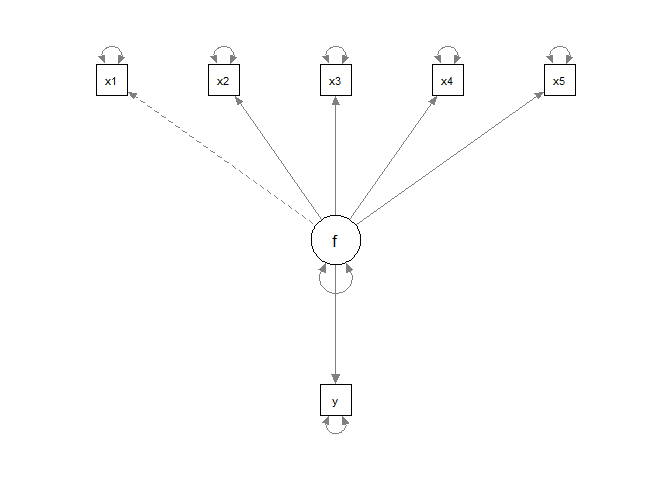
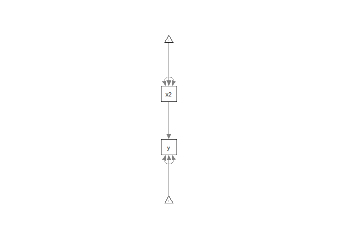
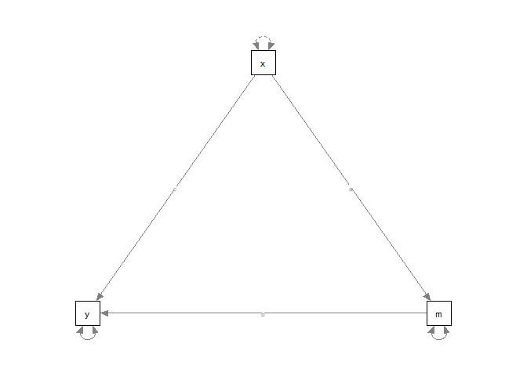
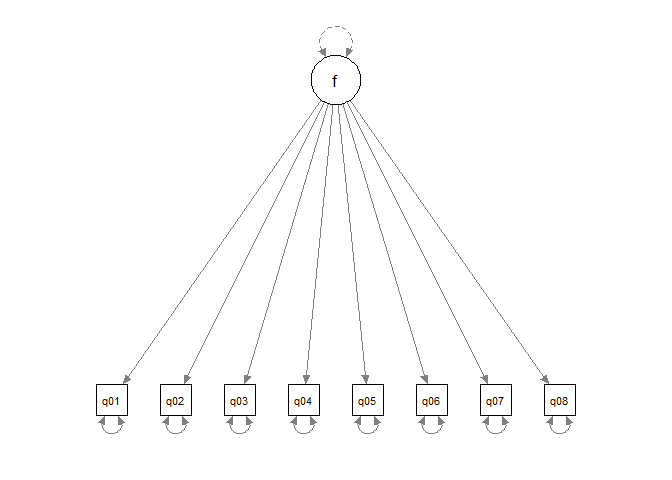

Untitled
================
Yoo Ri Hwang
3/28/2022

## Overview

In this project, I tried SEM.. like licking the surface of the SEM.

.

Also, I refered many materials (see the readme file).

### What is SEM

Source: in the readme file.

Structure Equation Modeling (SEM) analysis the network of relationship
between the variables (including latent constructs, and measured
variable ).

Unlike other conventional stat techniques, SES reqiures model
specification( including measurement error specification)

SES is linear statistics technique, and do not provide causality test.

Keep in mind that SES do not provide default model. SEM has a powerful
weapon- intuitive visulaization.

*Goals* 1) patterns of cov/cor among the variables 2) how much variance
can be explianed by this specificed model.

### Packages

``` r
library(lavaan)
```

    ## Warning: package 'lavaan' was built under R version 4.1.3

    ## This is lavaan 0.6-10
    ## lavaan is FREE software! Please report any bugs.

``` r
library(tidyverse)
```

    ## -- Attaching packages --------------------------------------- tidyverse 1.3.1 --

    ## v ggplot2 3.3.5     v purrr   0.3.4
    ## v tibble  3.1.4     v dplyr   1.0.8
    ## v tidyr   1.2.0     v stringr 1.4.0
    ## v readr   2.0.1     v forcats 0.5.1

    ## Warning: package 'tidyr' was built under R version 4.1.3

    ## Warning: package 'dplyr' was built under R version 4.1.3

    ## -- Conflicts ------------------------------------------ tidyverse_conflicts() --
    ## x dplyr::filter() masks stats::filter()
    ## x dplyr::lag()    masks stats::lag()

``` r
library(psych)
```

    ## 
    ## Attaching package: 'psych'

    ## The following objects are masked from 'package:ggplot2':
    ## 
    ##     %+%, alpha

    ## The following object is masked from 'package:lavaan':
    ## 
    ##     cor2cov

``` r
library(MASS)
```

    ## 
    ## Attaching package: 'MASS'

    ## The following object is masked from 'package:dplyr':
    ## 
    ##     select

``` r
library(mvnormalTest)
```

    ## Warning: package 'mvnormalTest' was built under R version 4.1.3

    ## 
    ## Attaching package: 'mvnormalTest'

    ## The following object is masked from 'package:psych':
    ## 
    ##     mardia

``` r
library(semPlot)
```

    ## Warning: package 'semPlot' was built under R version 4.1.3

### Simulate the data

``` r
demo.model <- '
y ~ .5*f 

f =~ .8*x1 + .8*x2 + .8*x3 + .8*x4 + .8*x5  

x1 ~~ (1-.8^2)*x1
x2 ~~ (1-.8^2)*x2
x3 ~~ (1-.8^2)*x3
x4 ~~ (1-.8^2)*x4
x5 ~~ (1-.8^2)*x5
'
simData <- lavaan::simulateData(demo.model, sample.nobs=200)

# see the describtive stats
psych::describe(simData)
```

    ##    vars   n mean   sd median trimmed  mad   min  max range  skew kurtosis   se
    ## x1    1 200 0.04 1.00  -0.01    0.03 1.09 -2.42 2.70  5.13  0.11    -0.42 0.07
    ## x2    2 200 0.09 1.06   0.04    0.10 1.17 -2.84 3.26  6.10 -0.03    -0.08 0.08
    ## x3    3 200 0.08 1.04   0.09    0.09 1.10 -2.97 2.82  5.80 -0.02    -0.06 0.07
    ## x4    4 200 0.08 1.05   0.07    0.05 1.02 -3.23 3.04  6.27  0.06     0.55 0.07
    ## x5    5 200 0.05 0.96   0.07    0.03 0.88 -2.71 2.89  5.59  0.18     0.06 0.07
    ## y     6 200 0.03 1.21  -0.05    0.02 1.29 -3.45 4.19  7.64  0.16     0.11 0.09

``` r
# multivariate nurmality test 

mv<-mardia(simData)
mv
```

    ## $mv.test
    ##           Test Statistic p-value Result
    ## 1     Skewness   66.6252  0.1565    YES
    ## 2     Kurtosis   -0.0261  0.9791    YES
    ## 3 MV Normality      <NA>    <NA>    YES
    ## 
    ## $uv.shapiro
    ##    W      p-value UV.Normality
    ## x1 0.9946 0.6976  Yes         
    ## x2 0.9947 0.7045  Yes         
    ## x3 0.9961 0.8975  Yes         
    ## x4 0.9882 0.0967  Yes         
    ## x5 0.9942 0.6378  Yes         
    ## y  0.9936 0.5365  Yes

``` r
#?simulateData

sim.cor <-cor(simData, use="pairwise.complete.obs", method="pearson")
sim.cor
```

    ##           x1        x2        x3        x4        x5         y
    ## x1 1.0000000 0.6171676 0.6159865 0.6725076 0.6514285 0.3618392
    ## x2 0.6171676 1.0000000 0.6245594 0.6788454 0.6601711 0.3678013
    ## x3 0.6159865 0.6245594 1.0000000 0.6543427 0.6064226 0.3477286
    ## x4 0.6725076 0.6788454 0.6543427 1.0000000 0.6776664 0.3269674
    ## x5 0.6514285 0.6601711 0.6064226 0.6776664 1.0000000 0.3085030
    ## y  0.3618392 0.3678013 0.3477286 0.3269674 0.3085030 1.0000000

### specify the model

``` r
tofit.model <- '
y ~ f 
f =~ x1+ x2 + x3 + x4 + x5 
x1 ~~ x1 
x2 ~~ x2 
x3~~x3 
x4~~x4 
x5~~x5 
'

tofit.model_m <- sem(tofit.model, simData)

summary(tofit.model_m, fit.measures=T)
```

    ## lavaan 0.6-10 ended normally after 20 iterations
    ## 
    ##   Estimator                                         ML
    ##   Optimization method                           NLMINB
    ##   Number of model parameters                        12
    ##                                                       
    ##   Number of observations                           200
    ##                                                       
    ## Model Test User Model:
    ##                                                       
    ##   Test statistic                                 4.465
    ##   Degrees of freedom                                 9
    ##   P-value (Chi-square)                           0.878
    ## 
    ## Model Test Baseline Model:
    ## 
    ##   Test statistic                               619.351
    ##   Degrees of freedom                                15
    ##   P-value                                        0.000
    ## 
    ## User Model versus Baseline Model:
    ## 
    ##   Comparative Fit Index (CFI)                    1.000
    ##   Tucker-Lewis Index (TLI)                       1.013
    ## 
    ## Loglikelihood and Information Criteria:
    ## 
    ##   Loglikelihood user model (H0)              -1451.644
    ##   Loglikelihood unrestricted model (H1)      -1449.411
    ##                                                       
    ##   Akaike (AIC)                                2927.287
    ##   Bayesian (BIC)                              2966.867
    ##   Sample-size adjusted Bayesian (BIC)         2928.850
    ## 
    ## Root Mean Square Error of Approximation:
    ## 
    ##   RMSEA                                          0.000
    ##   90 Percent confidence interval - lower         0.000
    ##   90 Percent confidence interval - upper         0.039
    ##   P-value RMSEA <= 0.05                          0.971
    ## 
    ## Standardized Root Mean Square Residual:
    ## 
    ##   SRMR                                           0.015
    ## 
    ## Parameter Estimates:
    ## 
    ##   Standard errors                             Standard
    ##   Information                                 Expected
    ##   Information saturated (h1) model          Structured
    ## 
    ## Latent Variables:
    ##                    Estimate  Std.Err  z-value  P(>|z|)
    ##   f =~                                                
    ##     x1                1.000                           
    ##     x2                1.080    0.088   12.338    0.000
    ##     x3                1.011    0.086   11.707    0.000
    ##     x4                1.120    0.086   13.044    0.000
    ##     x5                0.979    0.079   12.355    0.000
    ## 
    ## Regressions:
    ##                    Estimate  Std.Err  z-value  P(>|z|)
    ##   y ~                                                 
    ##     f                 0.644    0.109    5.886    0.000
    ## 
    ## Variances:
    ##                    Estimate  Std.Err  z-value  P(>|z|)
    ##    .x1                0.364    0.045    8.157    0.000
    ##    .x2                0.395    0.049    8.019    0.000
    ##    .x3                0.433    0.051    8.422    0.000
    ##    .x4                0.321    0.044    7.369    0.000
    ##    .x5                0.323    0.040    8.006    0.000
    ##    .y                 1.191    0.122    9.771    0.000
    ##     f                 0.625    0.095    6.542    0.000

``` r
inspect(tofit.model_m)
```

    ## $lambda
    ##    f y
    ## x1 0 0
    ## x2 2 0
    ## x3 3 0
    ## x4 4 0
    ## x5 5 0
    ## y  0 0
    ## 
    ## $theta
    ##    x1 x2 x3 x4 x5 y 
    ## x1  6               
    ## x2  0  7            
    ## x3  0  0  8         
    ## x4  0  0  0  9      
    ## x5  0  0  0  0 10   
    ## y   0  0  0  0  0  0
    ## 
    ## $psi
    ##   f  y 
    ## f 12   
    ## y  0 11
    ## 
    ## $beta
    ##   f y
    ## f 0 0
    ## y 1 0

``` r
semPlot::semPaths(tofit.model_m)
```

<!-- -->

lavaan package’s notation

**\~ : predict** (y\~x: y is predicted by x)

**=\~ : indicator** (latent variable =\~ observed indicator)

**\~\~** Covariance

**\~1: intercept or mean ** x\~1 : mean of variable x

**1**\* fixed parameter or loading to one

**NA**\* frees parameter or loading

**a**\*labels the parameter ‘a’ for model constraints

## Simple regression

before going further, let’s try simple regression

``` r
hey<-lm(y~x2, simData)
summary(hey)
```

    ## 
    ## Call:
    ## lm(formula = y ~ x2, data = simData)
    ## 
    ## Residuals:
    ##      Min       1Q   Median       3Q      Max 
    ## -2.77322 -0.80673 -0.01367  0.79818  3.07523 
    ## 
    ## Coefficients:
    ##              Estimate Std. Error t value Pr(>|t|)    
    ## (Intercept) -0.004453   0.079867  -0.056    0.956    
    ## x2           0.417907   0.075088   5.566 8.42e-08 ***
    ## ---
    ## Signif. codes:  0 '***' 0.001 '**' 0.01 '*' 0.05 '.' 0.1 ' ' 1
    ## 
    ## Residual standard error: 1.125 on 198 degrees of freedom
    ## Multiple R-squared:  0.1353, Adjusted R-squared:  0.1309 
    ## F-statistic: 30.98 on 1 and 198 DF,  p-value: 8.42e-08

results interpretaion:

as one unit increase in x1, the y score improves approaximatly 0.508,
and Significant. the residual standard error is 1.087. the residual
variance is (1.087)^2 = 1.181569

This can be done by Lavaan packages

``` r
hey2<-'
y ~ 1 + x2
x2~~x2
'

hey2fit<-sem(hey2,data=simData)
summary(hey2fit)
```

    ## lavaan 0.6-10 ended normally after 11 iterations
    ## 
    ##   Estimator                                         ML
    ##   Optimization method                           NLMINB
    ##   Number of model parameters                         5
    ##                                                       
    ##   Number of observations                           200
    ##                                                       
    ## Model Test User Model:
    ##                                                       
    ##   Test statistic                                 0.000
    ##   Degrees of freedom                                 0
    ## 
    ## Parameter Estimates:
    ## 
    ##   Standard errors                             Standard
    ##   Information                                 Expected
    ##   Information saturated (h1) model          Structured
    ## 
    ## Regressions:
    ##                    Estimate  Std.Err  z-value  P(>|z|)
    ##   y ~                                                 
    ##     x2                0.418    0.075    5.594    0.000
    ## 
    ## Intercepts:
    ##                    Estimate  Std.Err  z-value  P(>|z|)
    ##    .y                -0.004    0.079   -0.056    0.955
    ##     x2                0.090    0.075    1.206    0.228
    ## 
    ## Variances:
    ##                    Estimate  Std.Err  z-value  P(>|z|)
    ##     x2                1.123    0.112   10.000    0.000
    ##    .y                 1.254    0.125   10.000    0.000

``` r
semPlot::semPaths(hey2fit)
```

<!-- -->

results interpretaion:

the regression coifficient (0.508) is the same.

However, some difference is here. ML and OLS provide different residual
variance but the same coefficients.

## Path analysis

What is different between SEM and path analysis?

“SEM is a combination of multiple regression and factor analysis. Path
analysis deals only with measured variables. two or more measured
variables”
(Source:<https://theicph.com/wp-content/uploads/2016/09/How-to-conduct-Path-Analysis-and-SEM-for-Health-Research_24-Sep-2016_Prof-Bhisma-Murti.pdf>)
#### Data simulation

``` r
set.seed(1234)
x<-rnorm(100)
m<-0.5*x + rnorm(100)
y<-0.7*m + rnorm(100)
data <-data.frame(x=x,m=m,y=y)
```

#### model specification

``` r
medmodel<-'
y~c*x
m~a*x
y~b*m
# indirect effect (a*b)
ab:=a*b
# total effect
total:=c+(a*b)
'
```

``` r
medmodel_m<-sem(medmodel, data=data)
summary(medmodel_m, fit.measures=T)
```

    ## lavaan 0.6-10 ended normally after 1 iterations
    ## 
    ##   Estimator                                         ML
    ##   Optimization method                           NLMINB
    ##   Number of model parameters                         5
    ##                                                       
    ##   Number of observations                           100
    ##                                                       
    ## Model Test User Model:
    ##                                                       
    ##   Test statistic                                 0.000
    ##   Degrees of freedom                                 0
    ## 
    ## Model Test Baseline Model:
    ## 
    ##   Test statistic                                84.319
    ##   Degrees of freedom                                 3
    ##   P-value                                        0.000
    ## 
    ## User Model versus Baseline Model:
    ## 
    ##   Comparative Fit Index (CFI)                    1.000
    ##   Tucker-Lewis Index (TLI)                       1.000
    ## 
    ## Loglikelihood and Information Criteria:
    ## 
    ##   Loglikelihood user model (H0)               -281.061
    ##   Loglikelihood unrestricted model (H1)       -281.061
    ##                                                       
    ##   Akaike (AIC)                                 572.122
    ##   Bayesian (BIC)                               585.148
    ##   Sample-size adjusted Bayesian (BIC)          569.357
    ## 
    ## Root Mean Square Error of Approximation:
    ## 
    ##   RMSEA                                          0.000
    ##   90 Percent confidence interval - lower         0.000
    ##   90 Percent confidence interval - upper         0.000
    ##   P-value RMSEA <= 0.05                             NA
    ## 
    ## Standardized Root Mean Square Residual:
    ## 
    ##   SRMR                                           0.000
    ## 
    ## Parameter Estimates:
    ## 
    ##   Standard errors                             Standard
    ##   Information                                 Expected
    ##   Information saturated (h1) model          Structured
    ## 
    ## Regressions:
    ##                    Estimate  Std.Err  z-value  P(>|z|)
    ##   y ~                                                 
    ##     x          (c)    0.036    0.104    0.348    0.728
    ##   m ~                                                 
    ##     x          (a)    0.474    0.103    4.613    0.000
    ##   y ~                                                 
    ##     m          (b)    0.788    0.092    8.539    0.000
    ## 
    ## Variances:
    ##                    Estimate  Std.Err  z-value  P(>|z|)
    ##    .y                 0.898    0.127    7.071    0.000
    ##    .m                 1.054    0.149    7.071    0.000
    ## 
    ## Defined Parameters:
    ##                    Estimate  Std.Err  z-value  P(>|z|)
    ##     ab                0.374    0.092    4.059    0.000
    ##     total             0.410    0.125    3.287    0.001

``` r
semPaths(medmodel_m)
```

<!-- -->

## Confirmatory factor analysls

load the data

``` r
library(foreign)
dat <- read.spss("https://stats.idre.ucla.edu/wp-content/uploads/2018/05/SAQ.sav",
                                             to.data.frame=TRUE, use.value.labels = FALSE)
```

    ## re-encoding from UTF-8

``` r
head(dat,10)
```

    ##    q01 q02 q03 q04 q05 q06 q07 q08 q09 q10 q11 q12 q13 q14 q15 q16 q17 q18 q19
    ## 1    2   1   4   2   2   2   3   1   1   2   1   2   2   2   2   3   1   2   3
    ## 2    1   1   4   3   2   2   2   2   5   2   2   3   1   3   4   3   2   2   3
    ## 3    2   3   2   2   4   1   2   2   2   2   3   3   2   4   2   3   2   3   1
    ## 4    3   1   1   4   3   3   4   2   2   4   2   2   2   3   3   3   2   4   2
    ## 5    2   1   3   2   2   3   3   2   4   2   2   3   3   2   2   2   2   3   3
    ## 6    2   1   3   2   4   4   4   2   4   3   2   4   3   3   5   2   3   5   1
    ## 7    2   3   3   2   2   2   2   2   3   2   2   2   2   2   2   2   2   2   3
    ## 8    2   2   3   2   2   2   2   2   4   2   2   3   2   2   3   2   2   2   4
    ## 9    3   3   1   4   5   3   5   5   3   3   5   5   5   5   5   5   5   5   2
    ## 10   2   4   4   3   2   1   2   2   3   2   2   3   2   1   2   3   2   2   3
    ##    q20 q21 q22 q23
    ## 1    2   2   2   5
    ## 2    4   4   4   2
    ## 3    4   3   2   2
    ## 4    4   4   4   3
    ## 5    4   2   4   4
    ## 6    5   3   1   4
    ## 7    2   2   4   4
    ## 8    3   2   4   4
    ## 9    5   5   3   3
    ## 10   3   2   4   4

8 items, with one factor

``` r
cfa<- '
f =~ q01 + q02 + q03 + q04 + q05 + q06 + q07 + q08'

cfa8<- cfa(cfa, data=dat, std.lv=TRUE)
#std.lv=T automatically standardize the variance. 

summary(cfa8, fit.measures=T, standardized=T)
```

    ## lavaan 0.6-10 ended normally after 15 iterations
    ## 
    ##   Estimator                                         ML
    ##   Optimization method                           NLMINB
    ##   Number of model parameters                        16
    ##                                                       
    ##   Number of observations                          2571
    ##                                                       
    ## Model Test User Model:
    ##                                                       
    ##   Test statistic                               554.191
    ##   Degrees of freedom                                20
    ##   P-value (Chi-square)                           0.000
    ## 
    ## Model Test Baseline Model:
    ## 
    ##   Test statistic                              4164.572
    ##   Degrees of freedom                                28
    ##   P-value                                        0.000
    ## 
    ## User Model versus Baseline Model:
    ## 
    ##   Comparative Fit Index (CFI)                    0.871
    ##   Tucker-Lewis Index (TLI)                       0.819
    ## 
    ## Loglikelihood and Information Criteria:
    ## 
    ##   Loglikelihood user model (H0)             -26629.559
    ##   Loglikelihood unrestricted model (H1)     -26352.464
    ##                                                       
    ##   Akaike (AIC)                               53291.118
    ##   Bayesian (BIC)                             53384.751
    ##   Sample-size adjusted Bayesian (BIC)        53333.914
    ## 
    ## Root Mean Square Error of Approximation:
    ## 
    ##   RMSEA                                          0.102
    ##   90 Percent confidence interval - lower         0.095
    ##   90 Percent confidence interval - upper         0.109
    ##   P-value RMSEA <= 0.05                          0.000
    ## 
    ## Standardized Root Mean Square Residual:
    ## 
    ##   SRMR                                           0.055
    ## 
    ## Parameter Estimates:
    ## 
    ##   Standard errors                             Standard
    ##   Information                                 Expected
    ##   Information saturated (h1) model          Structured
    ## 
    ## Latent Variables:
    ##                    Estimate  Std.Err  z-value  P(>|z|)   Std.lv  Std.all
    ##   f =~                                                                  
    ##     q01               0.485    0.017   28.942    0.000    0.485    0.586
    ##     q02              -0.198    0.019  -10.633    0.000   -0.198   -0.233
    ##     q03              -0.612    0.022  -27.989    0.000   -0.612   -0.570
    ##     q04               0.632    0.019   33.810    0.000    0.632    0.667
    ##     q05               0.554    0.020   28.259    0.000    0.554    0.574
    ##     q06               0.554    0.023   23.742    0.000    0.554    0.494
    ##     q07               0.716    0.022   32.761    0.000    0.716    0.650
    ##     q08               0.424    0.018   23.292    0.000    0.424    0.486
    ## 
    ## Variances:
    ##                    Estimate  Std.Err  z-value  P(>|z|)   Std.lv  Std.all
    ##    .q01               0.450    0.015   30.734    0.000    0.450    0.656
    ##    .q02               0.685    0.019   35.300    0.000    0.685    0.946
    ##    .q03               0.780    0.025   31.157    0.000    0.780    0.675
    ##    .q04               0.499    0.018   27.989    0.000    0.499    0.555
    ##    .q05               0.623    0.020   31.040    0.000    0.623    0.670
    ##    .q06               0.951    0.029   32.711    0.000    0.951    0.756
    ##    .q07               0.702    0.024   28.678    0.000    0.702    0.578
    ##    .q08               0.581    0.018   32.849    0.000    0.581    0.764
    ##     f                 1.000                               1.000    1.000

``` r
semPaths(cfa8)
```

<!-- -->

interpretaion

``` r
round(cor(dat[,1:8]),2)
```

    ##       q01   q02   q03   q04   q05   q06   q07   q08
    ## q01  1.00 -0.10 -0.34  0.44  0.40  0.22  0.31  0.33
    ## q02 -0.10  1.00  0.32 -0.11 -0.12 -0.07 -0.16 -0.05
    ## q03 -0.34  0.32  1.00 -0.38 -0.31 -0.23 -0.38 -0.26
    ## q04  0.44 -0.11 -0.38  1.00  0.40  0.28  0.41  0.35
    ## q05  0.40 -0.12 -0.31  0.40  1.00  0.26  0.34  0.27
    ## q06  0.22 -0.07 -0.23  0.28  0.26  1.00  0.51  0.22
    ## q07  0.31 -0.16 -0.38  0.41  0.34  0.51  1.00  0.30
    ## q08  0.33 -0.05 -0.26  0.35  0.27  0.22  0.30  1.00

q 02, it is only -.23. If we see the corr table, also can find that q02
is weakly associated with other questions. q03,
